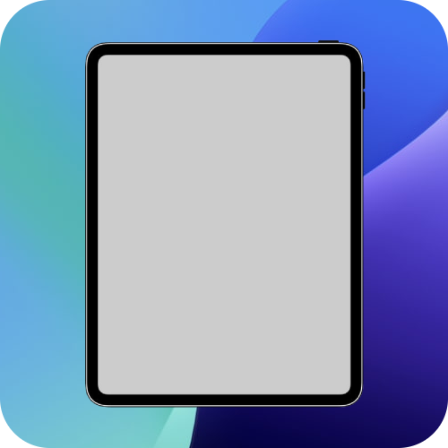
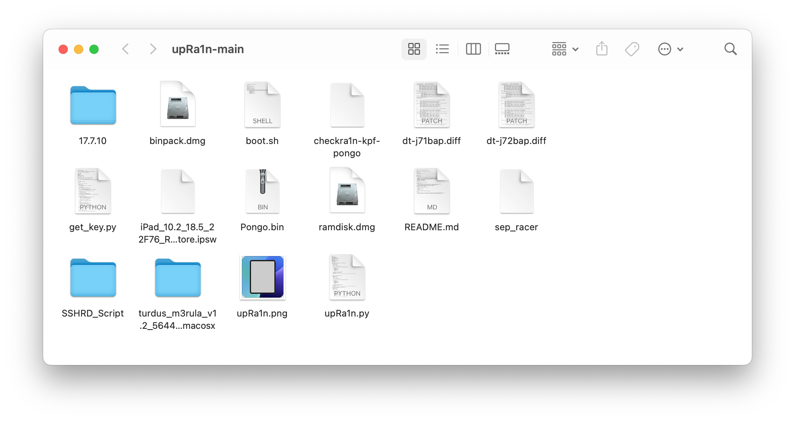

# upRa1n
Tethered dualboot iOS 18 on iPad 6 (Wi-Fi / Cellular)

## Description
This tool enables a tethered dualboot of iOS 18 on iPad 6 (Wi-Fi and Cellular models). The device must already be running iOS 17.7.10.

**Important:** This script only works on macOS (tested on macOS Monterey on a MacBook Pro 15" 2015).

## Dependencies
You must install and compile the following dependencies and copy their executables to `/usr/local/bin/` (using `make` or `./autogen.sh`):

- **aea** – https://github.com/dhinakg/aeota/tree/53e461d9788744bdd107e7d2043d71625324a682
- **iBootPatch2** – https://github.com/asdfugil/ibootpatch2/tree/043bb71a3fd819c6a2f0481873433a40e6420f3b
- **img4lib** – https://github.com/xerub/img4lib/tree/69772c72f3c08f021ec9fa4c386f2b3df60a38b7
- **devicetree-parse** – https://github.com/khanhduytran0/devicetree-parse.git
- **palera1n** – https://palera.in
- **homebrew** – https://brew.sh
- **Python 3** – https://python.org

## Installation

1. Install all dependencies listed above.
2. Clone this repository.
3. Download:
   - iOS 18 firmware (any version) for **iPad 7** (Wi‑Fi or Cellular, depending on your model).
   - iOS 17.7.10 firmware for **iPad 6** (Wi‑Fi or Cellular, matching your device).
4. Place the iOS 18 firmware file in the same directory as `upRa1n.py`.
5. Extract the iOS 17.7.10 firmware into a folder named `17.7.10/`.
6. Install required Python packages:
   ```bash
   pip3 install colorama art paramiko tqdm scp
   ```
7. Run the script with sudo:
   ```bash
   cd upRa1n
   sudo python3 upRa1n.py
   ```
8. Follow the on‑screen instructions in the terminal.

The `upRa1n` folder should look like this after completing all the steps:



## Credits

- **asdfugil (Nick Chan) for the original installation guide** (https://github.com/asdfugil/ipad6-ipados18).
- **verygenericname (Nathan) for SSHRD Script** (https://github.com/verygenericname/SSHRD_Script).
